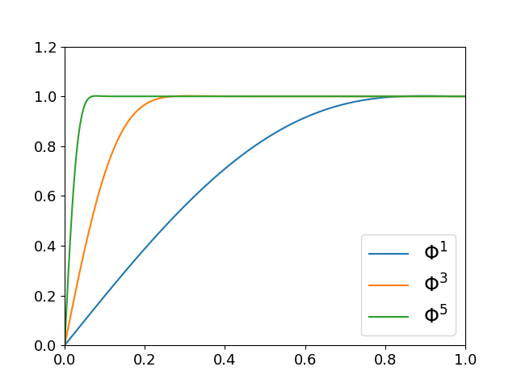

# Muon 优化器

*本文撰写于 2025 年 12 月 19 日，最后更新于 2025 年 12 月 22 日*

## 算法概览
Muon 是专门针对**神经网络二维参数**的优化器，其算法流程可被概述如下：

* **Algorithm Muon**
* Require：Learning rate $\eta$, momentum $\mu$
* Initialize $B_0 \leftarrow 0$
* **for t = 1, 2, …, T do**
* $\quad$ Compute gradient $G_t \leftarrow \nabla_\theta \mathcal L_t \left(\theta_{t-1}\right)$
* $\quad$ Compute momentum $B_t \leftarrow \mu B_{t-1} + G_t$
* $\quad$ Orthogonalize $O_t \leftarrow \text{NewtonSchulz}(B_t)$
* $\quad$ Update parameters $\theta_t \leftarrow \theta_{t-1} - \eta O_t$ 
* **end for**
* return $\theta_T$

其中 NewtonSchulz 迭代在 PyTorch 中的写法如下：

```python
def newtonschulz5(G, steps=5, eps=1e-7):
    assert G.ndim == 2
    a, b, c = (3.4445, -4.7750, 2.0315)
    X = G.bfloat16()
    X /= (X.norm() + eps)
    if G.size(0) > G.size(1):
        X = X.T
    for _ in range(steps):
        A = X @ X.T
        B = b * A + c * A @ A
        X = a * X + B @ X
    if G.size(0) > G.size(1):
        X = X.T
    return X
```
## 原理简介
### NewtonSchulz 迭代到底在做什么
设矩阵 $X \in \mathbb R^{m \times n}, m \le n$ 作奇异值分解有 $X = U \Sigma V^\top$，其中 $U \in \mathbb R^{m \times m}, \Sigma \in \mathbb R^{m \times m}, V \in \mathbb R^{n \times m}$，单步 NS 迭代给出如下输出：

$$X = aU \Sigma V^\top + bU\Sigma^3V^\top + cU\Sigma^5V^\top\tag 1$$

不妨设 $\Phi(\Sigma) = a \Sigma + b \Sigma^3 + c \Sigma^5$，k 步 NS 迭代后有：

$$X = U \, \Phi^k(\Sigma) \, V^\top \tag 2$$

让我们首先看看 $a = 2, b = -1.5, c = 0.5$ 的情况：

||
|---|
|<center>**Fig1. 步数增加时，NS 迭代收敛于 1**</center>|

从图像中
### 为何要近似正交化
## 系数的确立 & 转置的作用

## KIMI 的改进

## 参考文献
[1] <https://kellerjordan.github.io/posts/muon/>