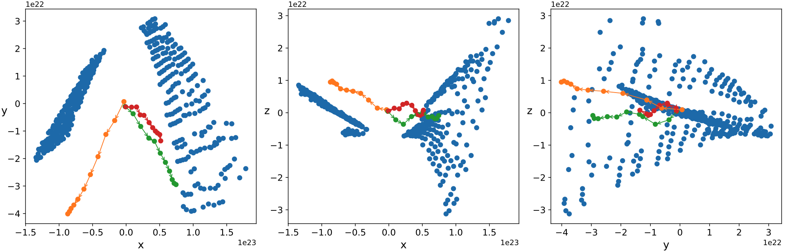

# 扩散模型系列（二）：前向与反向随机微分方程

*本文撰写于 2026 年 02 月 26 日，最后更新于 2026 年 03 月 04 日*

## 前向随机微分方程

文献 [[1]](https://arxiv.org/abs/2011.13456) 通过如下随机微分方程（Stochastic Differential Equation, SDE）描述数据的前向加噪过程：

$$\text d \mathbf x = \mathbf f(\mathbf x, t) \, \text dt + g(t) \, \text d \mathbf w\tag 1$$

其中 $\text d \mathbf w \sim \mathcal N(0, \text dt)$ 为无限小高斯噪声. 可见，样本在高维空间中的动力学行为在此处由确定性漂移项 $\mathbf f(\mathbf x, t) \, \text dt$ 和随机扰动项 $g(t) \, \text d \mathbf w$ 决定. 考虑经过 $\Delta t$ 时间后的状态变化，不难得到该过程的碰撞密度函数：

$$\psi(\Delta \mathbf x) = C \exp \left(- \dfrac{\left(\Delta \mathbf x - \mathbf f \Delta t\right)^2}{2 g^2 \Delta t}\right) \tag 2$$

回顾 [[2]](https://waylon-john-777.github.io/my-blog/#/扩散模型系列（一）：从%20Fokker-Plank%20方程谈起) 中关于漂移系数以及扩散系数的定义：

$$\mathbf A(\mathbf x, t) := \displaystyle \lim_{\Delta t \rightarrow 0} \dfrac{1}{\Delta t} \displaystyle \int \psi(\Delta \mathbf x) \Delta \mathbf x \, \text d \Delta \mathbf x = \mathbf f(\mathbf x, t) \tag 3$$

$$\mathbf B(\mathbf x, t) := \displaystyle \lim_{\Delta t \rightarrow 0} \dfrac{1}{\Delta t} \displaystyle \int \psi(\Delta \mathbf x) \Delta \mathbf x \Delta \mathbf x \, \text d \Delta \mathbf x = g^2(t) \, \mathbf I \tag 4$$

我们因此得到各向同性噪声下的 Fokker-Planck 方程：

$$\dfrac{\partial p}{\partial t} = -\nabla \cdot \left[p \, \mathbf f(\mathbf x, t)\right] + \dfrac{1}{2} g^2(t) \nabla^2 p\tag 5$$

## 反向随机微分方程

式 $(5)$ 的逆向演化为：

$$\dfrac{\partial p}{\partial t} = \nabla \cdot \left[p \, \mathbf f(\mathbf x, t)\right] - \dfrac{1}{2} g^2(t) \nabla^2 p\tag 6$$

观察发现其对应的 SDE 如下：

$$\text d \mathbf x = \left[g^2(t) \nabla \log p - \mathbf f(\mathbf x, t)\right] \, \text dt + g(t) \, \text d \mathbf w \tag 7$$

由于 $\mathbf f(\mathbf x, t)$ 和 $g(t)$ 均为预先人为设定的参数，唯一需要神经网络近似的是 $\nabla \log p$——该项亦被称作 score function，描述了给定位置与时刻下样本密度增加的方向.

如果用一句话概括图像生成的本质，那就是：<mark>**从已知的先验分布 $f$ 中采样，经过特定变换 $T$，得到服从目标分布 $h$ 的样本**</mark>. 事实上，这一范式远不止于生成模型——**经典的 Monte Carlo 采样同样在做类似的事情，区别仅在于对 $T$ 和 $h$ 的了解程度**：在逆 CDF 方法中，$T$ 与 $h$ 均有解析形式；在 Metropolis-Hastings 中，$T$ 变为隐式的马尔可夫链，$h$ 只需已知其未归一化形式；而到了深度生成模型，$T$ 由神经网络参数化，$h$ 则完全未知——你所拥有的仅是一组样本 $\mathcal D$.

## 各向异性噪声

一个对式 $(1)$ 的自然拓展是考虑各向异性噪声：

$$\text d \mathbf x = \mathbf f(\mathbf x, t) \, \text dt + \mathbf G(\mathbf x, t) \, \text d \mathbf w\tag 8$$

其中 $\mathbf G(\mathbf x, t) \in \mathbb R^{d \times d}$. 由于 $\text dx_i$ 为各独立高斯增量的线性组合，故有 $\text d \mathbf x \sim \mathcal N(\mathbf f \text dt, \mathbf G \mathbf G^\top \text dt)$，碰撞函数因此可写作：

$$\psi(\Delta \mathbf x) = C \exp \left(- \dfrac{1}{2} \left(\Delta \mathbf x - \mathbf f \Delta t\right)^\top \left(\mathbf G \mathbf G^\top \Delta t\right)^{-1} \left(\Delta \mathbf x - \mathbf f \Delta t\right)\right) \tag 9$$

积分得各向异性噪声下的 Fokker-Planck 方程：

$$\dfrac{\partial p}{\partial t} = -\nabla \cdot \left[p \, \mathbf f(\mathbf x, t)\right] + \dfrac{1}{2} \nabla \nabla : \left[p \, \mathbf G (\mathbf x, t) \mathbf G^\top (\mathbf x, t)\right]\tag {10}$$

为求逆向形式，做变换：

$$
\begin {equation}
\begin {aligned}
\dfrac{\partial p}{\partial t} &= \nabla \cdot \left[p \, \mathbf f(\mathbf x, t)\right] - \dfrac{1}{2} \nabla \nabla : \left[p \, \mathbf G (\mathbf x, t) \mathbf G^\top (\mathbf x, t)\right] \\ &= -\nabla \cdot \left[\nabla \cdot [p \, \mathbf G(\mathbf x, t) \mathbf G^\top (\mathbf x, t)] - p \, \mathbf f(\mathbf x, t)\right] + \dfrac{1}{2} \nabla \nabla : \left[p \, \mathbf G (\mathbf x, t) \mathbf G^\top (\mathbf x, t)\right] \\ &= -\nabla \cdot \left[p \, (\mathbf G (\mathbf x, t) \mathbf G^\top (\mathbf x, t) \cdot \nabla \log p + \nabla \cdot \mathbf G (\mathbf x, t) \mathbf G^\top (\mathbf x, t) - \mathbf f (\mathbf x, t))\right] + \dfrac{1}{2} \nabla \nabla : \left[p \, \mathbf G (\mathbf x, t) \mathbf G^\top (\mathbf x, t)\right]
\end {aligned} \tag {11}
\end {equation}
$$

对应的 SDE 形式为：

$$\text d \mathbf x = \left[\mathbf G (\mathbf x, t) \mathbf G^\top (\mathbf x, t) \cdot \nabla \log p + \nabla \cdot \mathbf G (\mathbf x, t) \mathbf G^\top (\mathbf x, t) - \mathbf f (\mathbf x, t)\right] \text dt + \mathbf G(\mathbf x, t) \, \text d \mathbf w\tag {12}$$

<div align="center">
  <br>
  <b>Fig 1. 逆扩散过程的三维投影图（摘自毕业论文）</b>
</div>

## 参考资料

[[1] Score-Based Generative Modeling through Stochastic Differential Equations](https://arxiv.org/abs/2011.13456)

[[2] 扩散模型系列（一）：从 Fokker-Plank 方程谈起](https://waylon-john-777.github.io/my-blog/#/扩散模型系列（一）：从%20Fokker-Plank%20方程谈起)

---

## 引用本文

```bibtex
@misc{waylonblog2026,
  author = {Waylon John},
  title = {扩散模型系列（二）：前向与反向随机微分方程},
  year = {2026},
  url = {https://waylon-john-777.github.io/my-blog/#/扩散模型系列（二）：前向与反向随机微分方程}
}
```